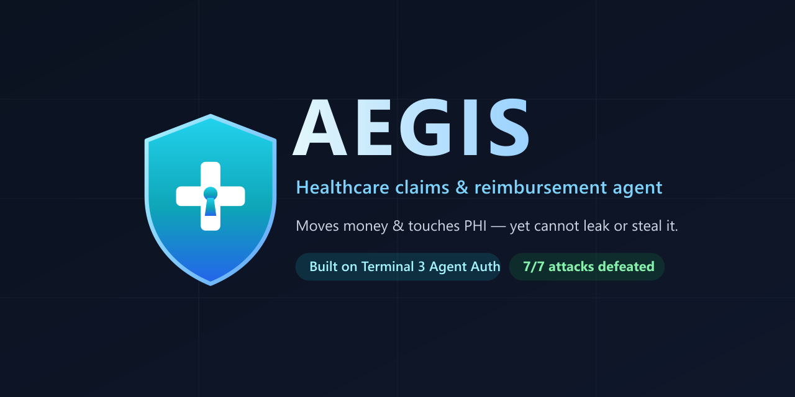

<p align="center">
  
</p>

# ⚕ Aegis — the agent that moves money and touches PHI, yet cannot be made to leak or steal

**An autonomous healthcare claims & reimbursement agent built on the [Terminal 3 Agent Dev Kit](https://www.terminal3.io/products/agent-developer-kit) (Agent Auth).**

Aegis files insurance claims and disburses patient reimbursements on a
clinic's behalf — handling protected health information (PHI) and moving real
money — **without ever holding plaintext PHI or an unbounded payout
capability.** Every action is cryptographically authorized by a patient-signed
delegation credential, enforced inside a Trusted Execution Environment (TEE),
and written to a tamper-evident audit trail.

Then we do the thing nobody else does: we **attack our own agent** with the
exact incidents the industry is afraid of — and prove it holds.

```
🛡  Aegis Red-Team Harness
[A1] Payout redirection via poisoned claim     ✓ DEFENDED   (EchoLeak)
[A2] Runaway over-spend                         ✓ DEFENDED   (Replit agent)
[A3] PHI exfiltration (SSN) via prompt injection✓ DEFENDED   (prompt injection)
[A4] In-flight request tampering (MITM)         ✓ DEFENDED
[A5] Invocation replay                          ✓ DEFENDED
[A6] Instant revocation                         ✓ DEFENDED
[A7] Stolen credential, wrong key               ✓ DEFENDED
Result: 7/7 attacks defended
```

---

## Why this matters

> *"80% of enterprise applications shipped in Q1 2026 embed at least one agent,
> yet only 31% of organizations have agents in live operation"* — governance
> and security being the top blocker. (Terminal 3, *Agentic AI Security &
> Governance Manifesto*)

Today's agents are handed API keys, card numbers, and PII directly. One prompt
injection — a poisoned email (EchoLeak), a poisoned document, a malicious tool
result — and the agent exfiltrates secrets or moves money to an attacker. The
root cause, in Terminal 3's words: *"absence of verifiable identity, scoped
permissions, and tamper-resistant audit at the action layer."*

Healthcare is the worst place for this to happen and the best place to prove a
fix: PHI is maximally sensitive **and** reimbursements are real money.

## How Aegis fixes it (Terminal 3's five principles, all exercised)

| Principle | In Aegis |
|---|---|
| **Verifiable identity** | Patient, clinic, and agent are `did:t3n` principals; the agent signs every call with a key bound into the credential. |
| **Programmable, scoped permissions** | The patient signs a delegation credential scoping *functions*, a *payee allowlist*, a *spend cap*, and *per-counterparty PHI disclosure* — enforced at the action layer, never by the agent's restraint. |
| **Confidential computation** | PHI lives only in the TEE vault; the agent composes requests with `{{profile.*}}` placeholders that are resolved **inside the TEE** at egress. The live executor verifies the node's Intel TDX attestation before trusting it. |
| **Tamper-resistant audit** | Every action is host-stamped (`subject`, `actor`, `vc_id`) into an append-only trail the agent cannot forge. |
| **Cross-boundary** | Selective disclosure means the insurer, pharmacy, and bank each receive only the fields they need — nothing more. |

## Architecture

```
 Patient (DID)                          Agent (own signing key)
    │ signs delegation credential           │ plans actions, signs each call
    │ (functions, payee allowlist,          │ with {{placeholders}} only
    │  cap, disclosure, TTL)                 ▼
    └──────────────► credential ──► [ buildInvocation: nonce + request_hash + agent_sig ]
                                                 │
                                                 ▼
                          ┌───────────────  TEE executor  ───────────────┐
                          │ 1 verify patient sig   6 check revocation     │
                          │ 2 verify agent sig     7 check function scope  │
                          │ 3 check request_hash   8 check payee + cap     │
                          │ 4 check nonce (replay) 9 enforce disclosure    │
                          │ 5 check validity      → resolve {{PHI}} here   │
                          │   PHI vault (plaintext never leaves)           │
                          │   host-stamped audit trail                     │
                          └────────────────────────────────────────────────┘
```

Two interchangeable executors implement the same interface:

- **live** — a real Terminal 3 (T3N) node (`AEGIS_MODE=live`, needs an API key).
- **mock** — an in-memory node that runs the **same cryptographic checks**
  using the SDK's own primitives, so the full demo and red-team run offline.

Built directly on the SDK's Agent Auth surface: `buildDelegationCredential`,
`signCredential`, `buildInvocationPreimage`, `signAgentInvocation`,
`canonicaliseCredential`, `ethRecoverEip191`, `revokeDelegation`, and TDX
attestation verification (`verifyDkgAttestation`).

## Run it

```bash
npm install
npm run demo       # happy path: delegate → claim → reimburse → audit → revoke
npm run redteam    # 7 real-world attacks, all defeated (exits non-zero on any breach)
npm test           # 17 unit tests (real signatures, every denial path)
```

No credentials needed — it runs against the offline TEE simulator by default.

### Going live

1. Claim an API key (free, instant) at <https://www.terminal3.io/claim-page>.
2. `cp .env.example .env` and set `T3N_API_KEY` (the ETH key shown once).
3. `AEGIS_MODE=live npm run demo`.

See [`docs/SUBMISSION.md`](docs/SUBMISSION.md) for the full writeup and the
mapping to the judging rubric.

## Project layout

```
src/
  config.ts            mode + env resolution (live vs offline)
  domain/claim.ts      claim model, PHI vault, placeholder mechanics
  t3/
    identity.ts        DID + key derivation
    policy.ts          patient policy → credential fields
    delegation.ts      issue + sign the delegation credential (Agent Auth)
    invocation.ts      per-call signed invocation (nonce, request_hash)
    crypto.ts          JCS canonicalization + hashing (matches the node)
    executor.ts        the agent↔TEE boundary
    mock-node.ts       offline TEE with REAL crypto verification
    wire.ts            request/envelope/receipt shapes
  agent/
    planner.ts         SafePlanner + CompromisedPlanner (for red-team)
    aegis.ts           the agent
  redteam/
    world.ts           shared scenario world
    scenarios.ts       A1–A7 attacks (executable security claims)
    run.ts             the CLI harness
  demo.ts              end-to-end happy path
test/                  vitest: authz + red-team
```

## License

MIT
